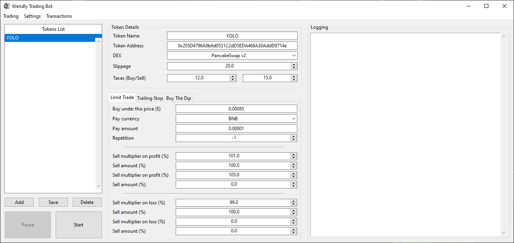
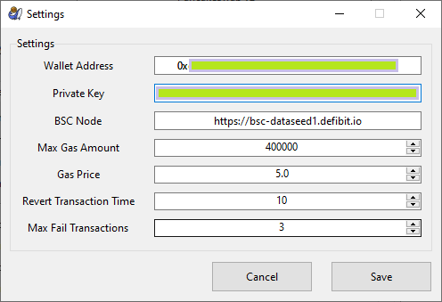
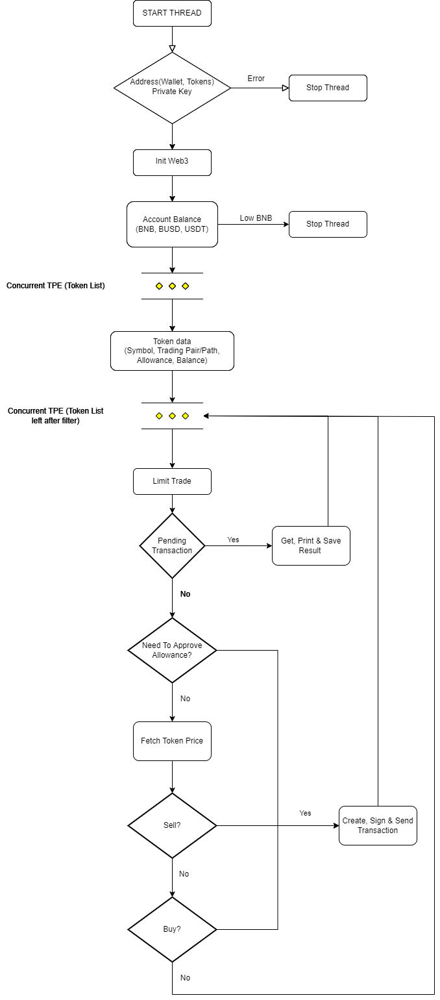

<!--
*** I'm using markdown "reference style" links for readability.
*** Reference links are enclosed in brackets [ ] instead of parentheses ( ).
*** See the bottom of this document for the declaration of the reference variables
*** for contributors-url, forks-url, etc. This is an optional, concise syntax you may use.
*** https://www.markdownguide.org/basic-syntax/#reference-style-links
-->

[![Contributors][contributors-shield]][contributors-url]
[![Forks][forks-shield]][forks-url]
[![Stargazers][stars-shield]][stars-url]
[![Issues][issues-shield]][issues-url]
[![MIT License][license-shield]][license-url]
[![LinkedIn][linkedin-shield]][linkedin-url]


<!-- PROJECT LOGO -->
<br />
<div align="center">
  <a href="https://github.com/darkwhite220/WendlyTradingBot">
    
  </a>

<h3 align="center">Wendly Trading Bot</h3>

  <p align="center">
    Fast & Easy BSC trading bot that give you total control over your trades, written in Python.
    <br />
  </p>
</div>


<!-- ABOUT THE PROJECT -->
## About The Project

### [Watch Demo Video (Youtube)](https://youtu.be/WR7h2HR1-J4)
<br>
<div align="center">
  <a href="https://github.com/darkwhite220/WendlyTradingBot/blob/main/images/screenshot1.png">
      
    </a>
  <a href="https://github.com/darkwhite220/WendlyTradingBot/blob/main/images/screenshot2.png">
      
    </a>
</div>

<br>

<details>
  <summary>Simple diagram after pressing "Start"</summary>  
    <div align="center">
      <a href="https://github.com/darkwhite220/WendlyTradingBot/blob/main/images/tradingdiagram.png">
        
      </a>
    </div>
</details>


### Built With

* [Python](https://www.python.org/)
* [Pip](https://pypi.org/project/pip/)
* [Web3](https://web3py.readthedocs.io/en/stable/)
* [Dacite](https://github.com/konradhalas/dacite)
* [Tkinter](https://docs.python.org/3/library/tkinter.html)
* [Sun Valley - Ttk Theme](https://github.com/rdbende/Sun-Valley-ttk-theme)
* [isort](https://pypi.org/project/isort/)
* [black](https://github.com/psf/black)

<p align="right">(<a href="#top">back to top</a>)</p>


### Features

* Limit Buy/Stop Loss

* Support Trades with: BNB, BUSD, USDT

* Supported Exchanges: PancakeSwap - ApeSwap - BabySwap - BiSwap - BUSTASwap

* Auto (Find Trading Pair, Approve Token, Calculate Slippage)

* Multi Buy/Sell Positions

* Detailed Summary Transaction File


<!-- LIMITATIONS EXAMPLES -->
### Limitations
Cannot sell tokens bought manually

<p align="right">(<a href="#top">back to top</a>)</p>


<!-- GETTING STARTED -->
## Getting Started

To get a local copy up and running follow these simple steps.

### Installation

1. Clone the repo
    ```sh
   git clone https://github.com/darkwhite220/WendlyTradingBot.git
    ```
2. Install dependencies  
   requirements.txt method:
    ```sh
   pip3 install -r requirements.txt
    ```
   or
    ```sh
   pip install -r requirements.txt
    ```
3. Run `main.py`

<p align="right">(<a href="#top">back to top</a>)</p>


<!-- USAGE EXAMPLES -->
## Usage

### Must Run as administrator

Preferably, create a new account in your MetaMask wallet and fund it with only what you are going to trade.

1) Add your Wallet Address & Private Key & node in "settings"
2) Add Token Address & Trading Details
3) Start

[How to create additional account in your wallet:][tuto-new-wallet]

[How to export private key:][tuto-export-pk]

[Free public nodes:][public-nodes]

<p align="right">(<a href="#top">back to top</a>)</p>


<!-- ROADMAP -->
## Roadmap

- [ ] More trading strategies (Trailing Stop, Buy The Dip, ...)
- [ ] Support more chains (ETH, ...)
- [ ] Sell tokens bought manually
- [ ] Improve UI

See the [open issues](https://github.com/darkwhite220/WendlyTradingBot/issues) for a full list of proposed features (and known issues).

<p align="right">(<a href="#top">back to top</a>)</p>


<!-- CONTRIBUTING -->
## Contributing
Wendly Trading Bot source code is open sourced in good faith, for transparency and educational purposes.

If you have features or fixes, I ask that you please consider contributing to this codebase, rather than releasing your own version.

This codebase represents months of hard work and learning as I've matured as an Python developer. I humbly request that you don't release low-effort clones for the sake of selling the app, If the app should be payed, I'd rather make it that way myself.

<p align="right">(<a href="#top">back to top</a>)</p>


<!-- LICENSE -->
## License

Distributed under the MIT License. See [LICENSE](LICENSE) for more information.

<p align="right">(<a href="#top">back to top</a>)</p>


<!-- CONTACT -->
## Contact

Dark White  
LinkedIn - [Dark White][linkedin-url]  
Twitter - [@darkwhite220](https://twitter.com/darkwhite220)  
Github - [darkwhite220](https://github.com/darkwhite220)  
Email: darkwhite220@gmail.com

You like this project or you made money from it & feeling generous <3

Donate BSC: 0xf528C5da505da03Bc3ec363202F1Da306459e28f

<p align="right">(<a href="#top">back to top</a>)</p>


<!-- MARKDOWN LINKS & IMAGES -->
<!-- https://www.markdownguide.org/basic-syntax/#reference-style-links -->
[contributors-shield]: https://img.shields.io/github/contributors/darkwhite220/WendlyTradingBot.svg?style=for-the-badge&logo=appveyor
[contributors-url]: https://github.com/darkwhite220/WendlyTradingBot/graphs/contributors
[forks-shield]: https://img.shields.io/github/forks/darkwhite220/WendlyTradingBot.svg?style=for-the-badge&logo=appveyor
[forks-url]: https://github.com/darkwhite220/WendlyTradingBot/network/members
[stars-shield]: https://img.shields.io/github/stars/darkwhite220/WendlyTradingBot.svg?style=for-the-badge&logo=appveyor
[stars-url]: https://github.com/darkwhite220/WendlyTradingBot/stargazers
[issues-shield]: https://img.shields.io/github/issues/darkwhite220/WendlyTradingBot.svg?style=for-the-badge&logo=appveyor
[issues-url]: https://github.com/darkwhite220/WendlyTradingBot/issues
[license-shield]: https://img.shields.io/github/license/darkwhite220/WendlyTradingBot.svg?style=for-the-badge&logo=appveyor
[license-url]: https://github.com/darkwhite220/WendlyTradingBot/blob/main/LICENSE
[linkedin-shield]: https://img.shields.io/badge/-LinkedIn-black.svg?style=for-the-badge&logo=linkedin&colorB=555
[linkedin-url]: https://www.linkedin.com/in/dark-white-42775218a/
[product-screenshot1]: images/screenshot1.png
[product-screenshot2]: images/screenshot2.png
[tradingdiagram-screenshot]: images/tradingdiagram.png
[tuto-new-wallet]: https://metamask.zendesk.com/hc/en-us/articles/360015289452-How-to-create-an-additional-account-in-your-wallet
[tuto-export-pk]: https://metamask.zendesk.com/hc/en-us/articles/360015289632-How-to-Export-an-Account-Private-Key
[public-nodes]: https://cointool.app/rpcServer/bsc
